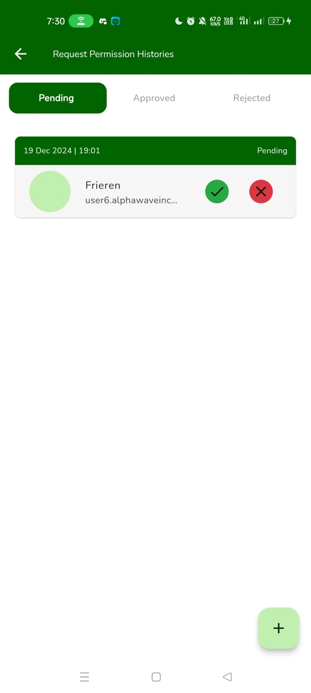

# Hadirsmart
Hadirsmart: The Online Attendance Application is a modern solution for attendance management, featuring advanced capabilities such as face recognition and geolocation to ensure that attendance can only be recorded by verified individuals at designated locations.

## 🚀 Feature:
- Auth (Employee, HRD)
- Attendance (Check in, Check Out)
- Request (Leave, Permission, Overtime, Face training)
- Geofencing Radius
- next update -> Event, Calendar, payment, UI :)

## ⭐ Screenshots 
| Login Page        |  Profile Page   | Request Attendance        |  Success Attendance   |
|--------------|-----------|--------------|-----------|
|  |       |  |       |

| Dashboard HRD        |  Request Leave   | REquest FaceTraining        |  Request Permission   |
|--------------|-----------|--------------|-----------|
|  |       |  |       |

| Dashboard Employee        |  Request Leave   | Request FaceTraining        |  Detail Request   |
|--------------|-----------|--------------|-----------|
|  |       |  |       |


# 💙 Flutter Readme:
## SDK Recommendations
- **Flutter**: 3.24.3
- **JDK**: 17.0.12

#### Command for Build Runner:
```bash
dart pub run build_runner watch --delete-conflicting-outputs
```

### Steps:
1. Use the **Hyper UI** extension:
   [Hyper UI Extension for Flutter](https://marketplace.visualstudio.com/items?itemName=denyocr.flutter-hyper-extension)
2. If there is a `state_util.dart` file, open it and comment out its contents.
3. Open `main.dart`. If the code related to `navigatorKey` causes an error, fix the imports to resolve the issue.

#### Note:
The application is still under development. </>

# 🔥 Laravel Readme:

This guide provides instructions to set up and run a Laravel project in your local development environment.

## Prerequisites

Ensure you have installed the following:  
- [PHP](https://www.php.net/downloads)  
- [Composer](https://getcomposer.org/download/)  
- [MySQL](https://dev.mysql.com/downloads/installer/) or other databases supported by Laravel  
- [Git](https://git-scm.com/downloads)  

## Installation Steps

1. **Clone the Repository**  
   ```bash
   git clone <repository_url>
   ```

2. **Install Dependencies**  
   ```bash
   composer install
   ```  

3. **Copy the Environment File**  
   ```bash
   cp .env.example .env
   ```  

4. **Generate the Application Key**  
   ```bash
   php artisan key:generate
   ```  

5. **Set Up the Database**  
   Update the `.env` file with your database configuration:  
   ```env
   DB_CONNECTION=mysql  
   DB_HOST=127.0.0.1  
   DB_PORT=3306  
   DB_DATABASE=your_database_name  
   DB_USERNAME=your_username  
   DB_PASSWORD=your_password  
   ```  

6. **Run Database Migrations and Seeding**  
   ```bash
   php artisan migrate:fresh --seed
   ```  

7. **Start the Local Server**  
   ```bash
   php artisan serve
   ```  

## Setting Up Face Recognition Training

Once the Laravel project is running locally, follow these steps to set up the face recognition training:

1. **Navigate to the Python App Directory**  
   ```bash
   cd ./python_app/
   ```  

2. **Install Dependencies**  
   ```bash
   pip install -r ./requirements.txt
   ```  

### Common Issues and Fixes

#### Python Issue 1

With Python 3.10.*, you may need to install Dlib (compatible with your Python version).

1. Clone this project:  
   ```bash
   git clone https://github.com/z-mahmud22/Dlib_Windows_Python3.x
   ```  

2. Navigate to the directory:  
   ```bash
   cd Dlib_Windows_Python3.x
   ```  

3. Run the following command:  
   ```bash
   python -m pip install dlib-19.22.99-cp310-cp310-win_amd64.whl
   ```  

#### References:  
[StackOverflow - Could not build wheels for Dlib](https://stackoverflow.com/questions/76629574/error-could-not-build-wheels-for-dlib-which-is-required-to-install-pyproject)

#### Python Issue 2

**Error:**  
```bash
WARNING: Failed to write executable - trying to use .deleteme logic
ERROR: Could not install packages due to an OSError: [WinError 2] The system cannot find the file specified: 'C:\\Python311\\Scripts\\face_detection.exe' -> 'C:\\Python311\\Scripts\\face_detection.exe.deleteme'
```

**Fix:**  
1. Run the following command:  
   ```bash
   pip install numpy --user
   ```  
   **Or:**  
   ```bash
   pip install face_recognition
   ```  

#### References:  
[StackOverflow - OSError: WinError 2](https://stackoverflow.com/questions/66322049/could-not-install-packages-due-to-an-oserror-winerror-2-no-such-file-or-direc)

#### Python Issue 3

**Error:** Occurs with Numpy v2.  
```bash
Something wrong: Unsupported image type, must be 8bit gray or RGB image.
```

**Fix:**  
1. Uninstall the current Numpy version:  
   ```bash
   pip uninstall numpy
   ```  

2. Install a compatible version:  
   ```bash
   pip install numpy==1.25.1
   ```  

#### References:  
[StackOverflow - Unsupported Image Type](https://stackoverflow.com/questions/48764485/dlib-face-detection-error-unsupported-image-type-must-be-8bit-gray-or-rgb-ima)
